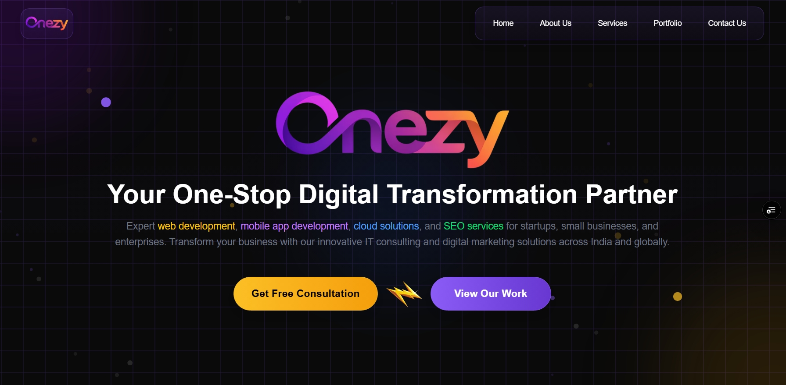
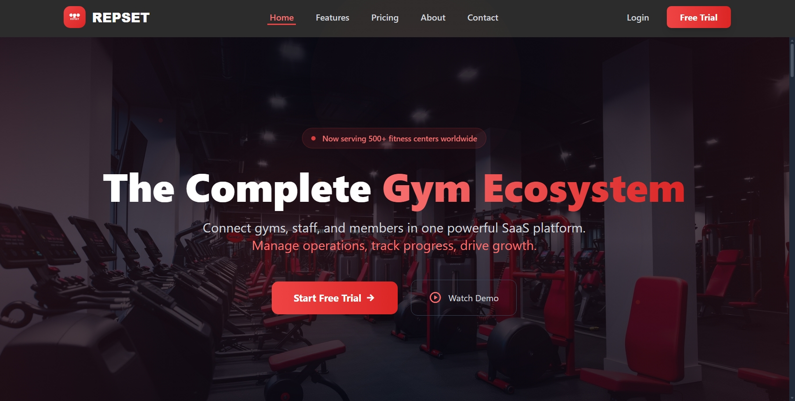
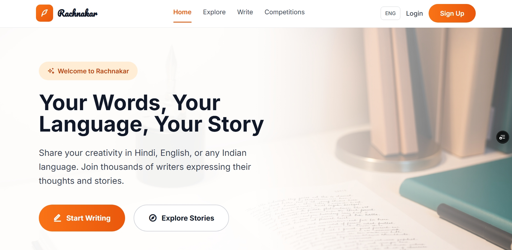

<!-- README.md for Manish Singh | Frontend Software Engineer -->

  

  
  
  
  
  

 

<table width="100%">
  <tr>
    <td align="left" valign="middle">
      <h2>👋 Hi, I’m <strong>Manish Singh</strong></h2>
      <ul>
        <li>🎓 <b>Frontend Software Engineer</b> & 2025 B.Tech Graduate from UIT RGPV, Bhopal.</li>
        <li>🚀 Passionate about building scalable, high-performance web applications with React, Next.js, and TypeScript.</li>
        <li>📦 <b> Key Projects:<a href="https://repset.in" target="_blank"> <b> Repset</b></a> (gym management SaaS), <a href="https://rachnakaar.vercel.app" target="_blank"><b>Rachnakaar</b></a> (multilingual writing platform).</li>
        <li>🌱 Expert in translating Figma designs into modular components while maintaining WCAG standards and optimizing Core Web Vitals.</li>
        <li>📍 Based in Bhopal, Madhya Pradesh</li>
      </ul>
    </td>
    <td align="center" width="185">
      
    </td>
  </tr>
</table>

---

<b>🚀 Professional Profile</b>

 
<ul>
  <li>
    <b>Frontend Software Engineer:</b> Detail-oriented engineer with proven expertise in building scalable, high-performance web applications using React, Next.js, and TypeScript.
  </li>
  <li>
    <b>Core Skills:</b> JavaScript (ES6+) · TypeScript · React.js · Next.js · HTML5 · CSS3 · SASS · Tailwind CSS · Material UI · Framer Motion
  </li>
  <li>
    <b>State & Data Management:</b> Redux Toolkit · Zustand · Context API · React Query · tRPC Client · Zod
  </li>
  <li>
    <b>Professional Experience:</b>
    <ul>
      <li><b>Braktt Technologies Pvt. Ltd.</b> – Software Development Engineer Intern (May 2023 - Jan 2024)</li>
      <li><b>Frontend Developer Intern</b> (Oct 2022 - Apr 2023)</li>
    </ul>
  </li>
  <li>
    <b>Key Achievements:</b> 25% reduction in LCP through optimization, 20-point increase in Lighthouse accessibility scores, 30% faster interaction times with React Query implementation.
  </li>
  <li>
    <b>Leadership:</b> Instructor at CodeCult, Web Master at Asper Club, mentoring 100+ students in modern React and frontend best practices.
  </li>
</ul>

---

<h3 align="center">🛠️ Technical Skills</h3>

**Frontend Stack**
 

**Styling & UI**
 

**State & Data Management**
 

 
React Query · Zustand · Context API · tRPC Client · Zod

**Tools & Backend**
 

**Testing & Quality**
 
Lighthouse Audits · Chrome DevTools · Cross-browser Testing · WCAG Compliance

---

---

<h3 align="center">🚩 Featured Projects</h3>

### �  Onezy Live – Portfolio & Agency Website

**Tech Stack:** `Next.js 15` • `React 19` • `TypeScript` • `Tailwind CSS`

A Modern, Full-Stack Portfolio & Agency Website built with cutting-edge web technologies. Features stunning UI, robust admin panel, and seamless user experience for showcasing services and projects.

**🔗 [Live Demo](https://onezy.in/)** <!-- | [📖 Case Study](https://manishsingh.me/projects/onezy) -->

---

### 🏋️ Repset – Gym Management SaaS

**Tech Stack:** `Next.js` • `Prisma` • `Clerk` • `TypeScript` • `PostgreSQL`

A modern SaaS platform designed for gyms and fitness studios. Handles membership management, attendance, analytics, and online payments with multi-tenant architecture.

**🔗 [Live Demo](https://repset.in/)** <!-- | [📖 Case Study](https://manishsingh.me/projects/repset) -->

---

### ✍️ Rachnakaar – Multilingual Writing Platform

**Tech Stack:** `Next.js` • `TypeScript` • `Prisma` • `Clerk`

A modern platform for Indian writers to share stories, poems, and creativity in their native languages. Features rich text editing, writing competitions, and social features with full support for Indian language scripts.

**🔗 [Live Demo](https://rachnakaar.vercel.app/)** • **💻 [Code](https://github.com/MAnishSingh13275/rachnakaar.git)** <!-- | [📖 Case Study](https://manishsingh.me/projects/rachnakaar) -->

---

### 🤖 Gurukool – AI-Powered Learning Platform

**Tech Stack:** `Next.js` • `Langchain` • `OpenAI` • `tRPC`

AI-powered learning platform for students, offering curated study materials, previous year question papers, and contextual PDF-based answering with intelligent content generation.

**🔗 [Live Demo](https://gurukool.tech)** • **💻 [Code](https://github.com/MAnishSingh13275/Gurukool)** <!-- | [📖 Case Study](https://manishsingh.me/projects/gurukool) -->

---

<h3 align="center">🏆 Badges & Achievements</h3>

  

  <a href="https://manishsingh.me" target="_blank"><b>🌐 Portfolio</b></a> •
  <a href="mailto:smanish14322@gmail.com"><b>✉️ Email</b></a> •
  <a href="https://www.linkedin.com/in/singh-manish1/" target="_blank"><b>🔗 LinkedIn</b></a> •
  <a href="https://github.com/singh-manish1" target="_blank"><b>🔗 GitHub</b></a> •
  <a href="tel:+916268530480"><b>📞 +91 6268530480</b></a>

---

### 🐍 GitHub Contribution Graph Snake

  <picture>
    <source media="(prefers-color-scheme: dark)" srcset="https://github.com/singh-manish1/singh-manish1/blob/output/github-contribution-grid-snake-dark.svg" />
    <source media="(prefers-color-scheme: light)" srcset="https://github.com/singh-manish1/singh-manish1/blob/output/github-contribution-grid-snake.svg" />
    
  </picture>

  
   
  <i>Made with ❤️ by Manish Singh</i>

